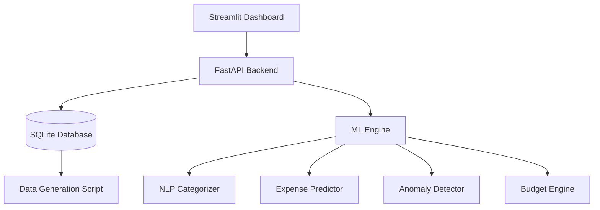

# Personal Expense Prediction & Smart Budget Planning System

## 🌟 Overview
The **Personal Expense Prediction & Smart Budget Planning System** is a professional-grade financial analytics platform designed to help users manage their finances through data-driven insights. It leverages Machine Learning, Time Series Forecasting, and Anomaly Detection to provide a complete picture of financial health.

## 🚀 Key Features
- **Intelligent Categorization**: Automatically classifies expense descriptions using NLP (TF-IDF + Logistic Regression).
- **Expense Forecasting**: Predicts future spending for the next 30 days using Random Forest Time Series models.
- **Anomaly Detection**: Flags unusual spending behavior using statistical Z-Scores and Isolation Forest algorithms.
- **Smart Budgeting**: Recommends monthly budget limits per category based on historical spending volatility ($\mu + \alpha\sigma$).
- **Financial Health Scoring**: Calculates a real-time score based on savings-to-income ratios.
- **Interactive Dashboard**: A premium Streamlit-based UI with Plotly visualizations.

## 🏗️ System Architecture
The system follows a modular design for scalability and maintainability:



## 📂 Project Structure
- `app/`: Contains the frontend dashboard (`dashboard.py`) and backend API (`main.py`).
- `src/`: Core logic and data processing.
    - `database.py`: SQLAlchemy models and SQLite connection logic.
    - `preprocessing.py`: Feature engineering pipeline.
    - `generate_data.py`: Synthetic data generator for testing.
    - `ml/`: Individual Machine Learning modules.
- `models/`: Persistent storage for trained ML models.
- `data/`: Location of the SQLite database file (`expenses_system.db`).
- `venv/`: Python virtual environment.

## 📊 Database Schema (SQLite)
- **Users**: Profile info and monthly income.
- **Expenses**: Transaction records (amount, category, date, description).
- **Budgets**: Recommended and user-defined budget limits.
- **Anomalies**: Records of detected abnormal spending.
- **Recurring_Expenses**: Automated detection of subscriptions and bills.

## 🛠️ Machine Learning Details
### Expense Prediction
Uses `RandomForestRegressor` with:
- **Lag Features**: Past 1, 7, and 30-day spending.
- **Time Features**: Day of week, month, and weekend indicators.
- **Rolling Stats**: 30-day moving averages.

### Anomaly Detection
- **Z-Score**: Identifies spikes within specific categories.
- **Isolation Forest**: Detects multivariate outliers in multi-dimensional spending space.

### NLP Categorization
- **Pipeline**: `TfidfVectorizer` (unigrams/bigrams) + `LogisticRegression`.
- **Capability**: Instantly maps free-form text to standardized categories.

## ⚙️ Setup & Installation
1. **Prerequisites**: Python 3.10+
2. **Setup Environment**:
   ```powershell
   python -m venv venv
   .\venv\Scripts\activate
   pip install -r requirements.txt  # (Or use the pre-installed venv)
   ```
3. **Initialize & Train**:
   ```powershell
   $env:PYTHONPATH="src"
   python src/database.py
   python src/generate_data.py
   python src/ml/nlp_categorizer.py
   python src/ml/expense_prediction.py
   python src/ml/anomaly_detection.py
   python src/ml/budget_engine.py
   ```
4. **Run Dashboard**:
   ```powershell
   streamlit run app/dashboard.py
   ```

## 📈 Performance Targets
- **Accuracy**: R² Score > 0.85 (Target for Time Series).
- **Response**: Real-time categorization and anomaly flagging.
- **Scalability**: Handles thousands of transactions efficiently via SQLite indexing.
